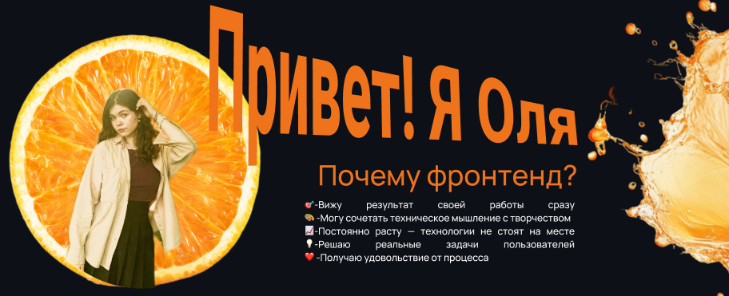

  

## 👋 Обо мне
Frontend-разработчик, активно развивающийся в веб-разработке. На практике освоила полный цикл создания веб-приложений: от проектирования интерфейса и верстки до написания клиентской логики и интеграции с бекендом.

Ищу возможность присоединиться к сильной команде, где смогу применять свои знания и профессионально расти.

---

## 🎓 Образование

| Годы | Учебное заведение | Специальность |
|------|-------------------|---------------|
| 2023–2027 | РХТУ им. Д.И. Менделеева | Информационные системы и технологии (бакалавриат) |

---

## 🚀 Мои проекты

### NFT Маркетплейс

> Пользователь может просматривать галерею цифровых токенов, фильтровать их по категориям и видеть детальную информацию о каждом NFT.

**Стек:** TypeScript, JavaScript, React, SCSS, REST API, БЭМ

---

### CampusNet (система управления заявками общежития)

> Полнофункциональное веб-приложение для автоматизации подачи и обработки заявок в студенческом общежитии.

**Стек:** JavaScript, Node.js, Express, SQLite, REST API, HTML5, SCSS, БЭМ, адаптивная вёрстка, анимация, Figma

---

## 🛠️ Навыки

---

> 💡 *"Качество — это не действие, а привычка"*
